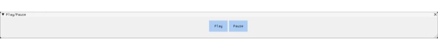

# Vulture Engine

Vulture Engine is a 3D Game Engine developed for a university project in CITM UPC (Terrasa, Spain) in our degree in Videogame Developement and Design.

## Authors

* José Rodríguez: [https://github.com/joserm45](https://github.com/joserm45)

* Manav Lakhwani: [https://github.com/manavld](https://github.com/manavld)

## Instructions

Download the .zip in the last release in [https://github.com/joserm45/VultureEngine/releases](https://github.com/joserm45/VultureEngine/releases) and open the file .exe to use the game engine.

## Github Repository

[https://github.com/joserm45/VultureEngine](https://github.com/joserm45/VultureEngine)

## Game Engine Screenshot

# Systems

## Hierarchy

The hierarchy contains all **game objects** in the scene  with its corresponding parents and children. The scene is already named and a main camera is automatically created, when game objects are created or dragged, it will be placed as a child of the existing scene as it will show on the game engine scene. All game objects can be editted, if a game object with childs is editted, its childs will perfom the same way.

## Inspector

In the inspector at the right of the screen there will be **information** about the game object selected in the hierarchy.
All game objects will contain its name and a component transform to be able to move its position, rotation and scale.
If a game object is has a mesh, it will show a component mesh with information about the file which it corresponds to (his path).
If the game object contains a material, it will show a component material with infomation about it (its path and size) and some options to edit it.

If the game object corresponds to a camera, the component camera will appear and the main view of the camera can be editted.

## Optimization

Quadtree: With Static Game Object check box.
Camera Culling: hide Game Objects that are not in Main Camera.

## Mouse Pickying

With the mouse we can select and put the focus to Game Object on the scene as well as in the hierarchy.

## Engine State

On the top of the screen there is an engine state controller with its commands "Start/Pause/Stop" that will show the scene from the main camera perspective when played.

## Bounding Box

We use AABB to encapsulate meshes and discarded using frustum culling in editor mode and mouse picking enabled to select game object on scene.

## Configuration

There is a configuration window where the user will be able to see the application information including the fps is running at, main information about the input and harware and will be able to edit the window characteristics of the application.

## Console

A console window will be appear in the bottom of the screen indicating the user what the app is doing and showing error information if needed.

# Controls

* WASD: Camera Movement
* Right Click: Rotate Camera
* Shift: Duplicate Speed Movement
* Mouse Wheel: Zoom in and out
* F: Focus Camera to Gameobject
* Alt+Left Click: Rotate around Gameobject
* Drag&Drop: Drag any model or texture to apply to scene

## Tools Used

* Visual Studio 2017: [https://visualstudio.microsoft.com/es/downloads/](https://visualstudio.microsoft.com/es/downloads/)
* ImGui 1.51: [https://github.com/ocornut/imgui](https://github.com/ocornut/imgui)
* SDL 2.0.6: [https://www.libsdl.org/](https://www.libsdl.org/)
* Glew 2.0.0: [http://glew.sourceforge.net/](http://glew.sourceforge.net/)
* MathGeoLib 1.5: [https://github.com/juj/MathGeoLib](https://github.com/juj/MathGeoLib)
* OpenGL 3.1: [https://www.opengl.org/?](https://www.opengl.org/?)
* Assimp 4.1.0: [http://www.assimp.org/index.php/downloads](http://www.assimp.org/index.php/downloads)
* DevIL 1.8.0: [http://openil.sourceforge.net/download.php](http://openil.sourceforge.net/download.php)
* Par Shapes: [https://github.com/prideout/par](https://github.com/prideout/par)

## License

We use the MIT License this is a permissive free software license originating at the Massachusetts Institute of Technology.

MIT License

Copyright (c) 2019 Jose Rodriguez & Manav Lakhwani

Permission is hereby granted, free of charge, to any person obtaining a copy of this software and associated documentation files (the “Software”), to deal in the Software without restriction, including without limitation the rights to use, copy, modify, merge, publish, distribute, sublicense, and/or sell copies of the Software, and to permit persons to whom the Software is furnished to do so, subject to the following conditions:

The above copyright notice and this permission notice shall be included in all copies or substantial portions of the Software.

THE SOFTWARE IS PROVIDED “AS IS”, WITHOUT WARRANTY OF ANY KIND, EXPRESS OR IMPLIED, INCLUDING BUT NOT LIMITED TO THE WARRANTIES OF MERCHANTABILITY, FITNESS FOR A PARTICULAR PURPOSE AND NONINFRINGEMENT. IN NO EVENT SHALL THE AUTHORS OR COPYRIGHT HOLDERS BE LIABLE FOR ANY CLAIM, DAMAGES OR OTHER LIABILITY, WHETHER IN AN ACTION OF CONTRACT, TORT OR OTHERWISE, ARISING FROM, OUT OF OR IN CONNECTION WITH THE SOFTWARE OR THE USE OR OTHER DEALINGS IN THE SOFTWARE.
